<!-- this svg+css thing is pretty much stolen from https://github.com/sindresorhus/css-in-readme-like-wat -->
<a href="https://github.com/sindresorhus/css-in-readme-like-wat/blame/master/header.svg"></a>
<br>

just like you, i do open source things. at work i do backend PHP and iOS (objc).

```js
// todo: add more things here.
```

<!--
**vladdeSV/vladdeSV** is a ✨ _special_ ✨ repository because its `README.md` (this file) appears on your GitHub profile.

Here are some ideas to get you started:

- 🔭 I’m currently working on ...
- 🌱 I’m currently learning ...
- 👯 I’m looking to collaborate on ...
- 🤔 I’m looking for help with ...
- 💬 Ask me about ...
- 📫 How to reach me: ...
- 😄 Pronouns: ...
- ⚡ Fun fact: ...
-->
